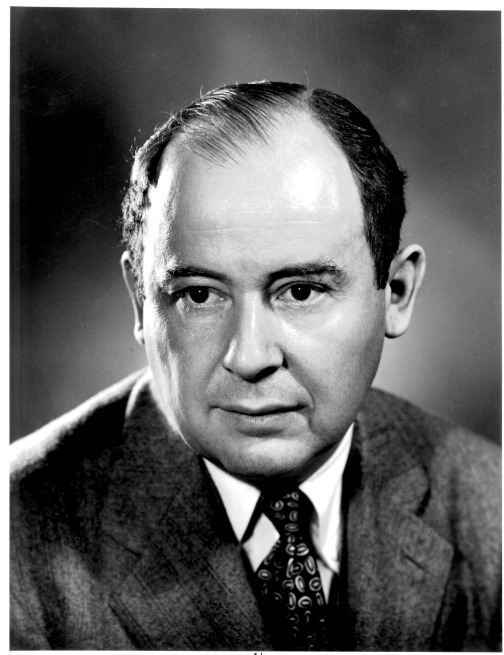
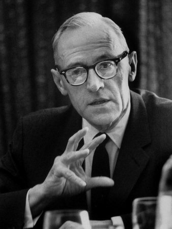

===================
Creo que me mira...
===================

Y es que la vida tiene mucho que ver con la asunción de riesgos. Si
volvemos a nuestra fiesta originaria bien podría ser que tras la
panorámica sobre la sala, nuestro protagonista se hubiera fijado en
una chica y se planteara si presentarse el mismo o no.

La mayor parte de nosotros sufre al acercarse a desconocidos, más
aún si los ve como víctimas potenciales de su cortejo. Tenemos
miedo al rechazo y de algún modo nos planteamos situaciones así
como una lotería en la que premio bien pudiera ser obtener la
atención de la otra persona y en la que el “castigo” más o menos
probable sería recibir un desaire. Esta claro pues que en este juego,
la variable en la que se paga (o cobra) a los jugadores no es otra que
la autoestima. Y que el tipo de elección al que se somete nuestro
héroe es la que los economistas conocemos como elección bajo
condiciones de incertidumbre,
modelizada por John Von
Neunann y Oskar Morgensten (fotografías de la derecha) en el
famoso (y difícil) libro5 en el que enunciaron por primera vez la
Teoría de Juegos [#juegos]_.

.. [#juegos] "Theory of Games and Economic Behaviour" Princeton University
             Press 1944 (en biblioteca de la UAM se puede encontrar una
             tercera edición de 1953)

   John von Neumann / `Public Domain`_

.. _Public Domain: http://en.wikipedia.org/wiki/File:JohnvonNeumann-LosAlamos.gif

   Oskar Morgenstern / Public Domain

En este modelo los individuos asignan probabilidades a las posibles respuestas
que pueden encontrar en la persona a la que se presentan. Para simplificar
diremos que puede encontrar dos respuestas únicamente: atención o desaire. Y
que de algún modo conoce también cuanto le puede doler o alegrar una u otra
alternativa o mejor aún, como engordaría su ego a medida que obtuviera
atención e interés de la otra parte.

A partir de estos datos podríamos trazar una función de "satisfacción
esperada" y jugar con ella. Esta satisfacción esperada sería igual a la suma
del efecto sobre el nivel de satisfacción del individuo (lo que los
economistas llamamos función de Utilidad) de cada uno de los posibles
resultados multiplicados por la probabilidad de que ocurra.  Por ejemplo
imaginemos que se trata de un individuo que si obtiene la atención de la chica
(1/3 de probabilidades a favor) sumará 100 puntos a su índice de autoestima y
si no, perderá otros cien. La utilidad esperada de autopresentarse sería:

.. note::

    .. math::

        \text{Utilidad Esperada} = \text{(Dolor generado por perder 100 puntos
        de autoestima)} \times \frac{2}{3}  + \text{(Satisfacción generada por
        ganar 100 puntos de autoestima)} \times \frac{1}{3}

Por otro lado podemos calcular el "valor esperado" que no es otra cosa que la esperanza
matemática de presentarse en términos de autoestima:

.. math::

    VE = -100 \times \frac{1}{3} + 100 \times \frac{1}{3} = -33.33333

.. note::

    Ahora representemos los resultados y las utilidades en ejes. En el de
    abcisas representaremos su autoestima y los posibles resultados (ganar o
    perder 100 puntos) En el de ordenadas como queda su índice general de
    satisfacción (Utilidad) tras cada uno de los posibles sucesos

    .. image:: images/valor_espe.png
       :align: center

.. note::

    Ahora uniremos ambos puntos con un segmento y proyectaremos el valor
    esperado (es decir -33) con lo que obtendremos la Autoestima esperada de
    presentarse.

    .. image:: images/valor_espe2.png
       :align: center

.. note::

    Al hacer esto hemos obtenido un nuevo punto de la función de utilidad, si
    lo proyectamos sobre el eje de abcisas obtenemos un nuevo valor en
    pesetas, se trata del “equivalente cierto”, esto es, la cantidad de
    autoestima que el jugador estaría dispuesto a perder con tal de no tener
    que autopresentarse.

    .. image:: images/valor_espe3.png
       :align: center

¿Qué quiere decir esto? Si la mayor parte de la Humanidad es como parece
aversa al riesgo, es decir tímida en mayor o menor medida, la curva de
Utilidad será cóncava en casi todos los casos. Esto es lo que hace que el
equivalente cierto sea menor que el valor esperado, es decir que el individuo
esté dispuesto a tragarse más ego del que puede esperar perder como media al
autopresentarse, con tal de no pasar el mal trago.

Esto parece ser una buena explicación a varios fenómenos constatados
empíricamente:

* La mayor parte de relaciones surgen a partir de la presentación de un
  tercero (seguramente porque en la mayor parte de las ocasiones optemos bien
  por tragarnos el orgullo y pedir que nos presente un amigo común, bien
  porque directamente ni lo intentamos)

* Buena parte de nuestra vida social con desconocidos se produce bien en el
  marco de una "celebración con anfitrión" (en la que alguien acaba
  presentando a todos) bien ligada al consumo de productos que afectan a
  nuestra percepción del riesgo (alcoholes y otros psicotrópicos)

De este último modo, los individuos podrían estar intentando modificar su
propia curva de Utilidad. Si la curva fuera convexa, ocurriría lo contrario, y
el equivalente cierto estaría a la derecha en el eje de abcisas del valor
esperado, es decir se arriesgarían a las calabazas y los desaires con más
probabilidad de la que estadísticamente cabría esperar.  Ese tipo de
comportamientos se llama preferencia por el riesgo en términos económicos y en
nuestro caso posiblemente "ser desenvuelto" o "extrovertido".  Finalmente si
consiguieran que su función de utilidad fuera rectilínea, coincidirían valor
esperado y equivalente cierto y tendríamos un caso de "indiferencia ante el
riesgo", es decir obtendríamos como media los mismos desaires que las
probabilidades nos sugieren.

